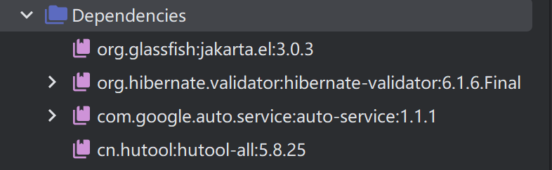
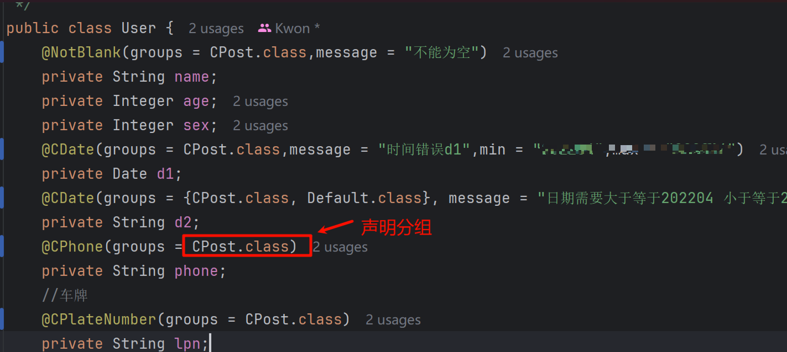
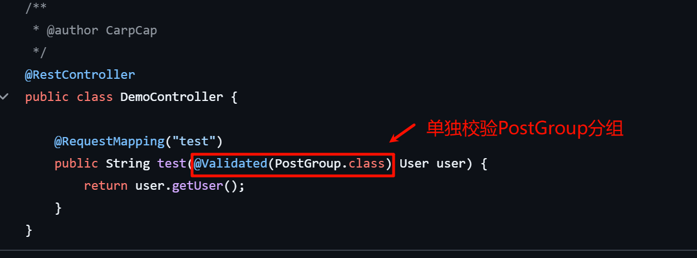
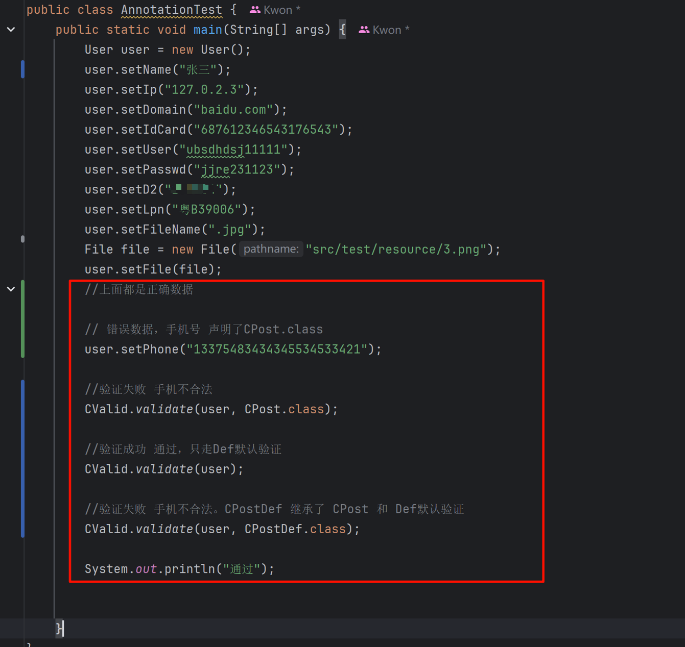

# Hibernate Validator Plus 增强版 🔧

基于 Hibernate Validator 的扩展工具包，提供更多常用注解、分组校验、校验工具类等，帮助开发者更便捷地完成 Java 对象或请求参数的验证。

依赖模块精简，整体架构更加轻量、高效。


---


## 🛠 使用示例

https://github.com/carpcap/hibernate-validator-plus-demo

### 根据不同分组来分别校验场景（内置5类分组）

声明分组类别



通过Spring Mvc自动校验



调用提供的工具类进行手动校验 校验失败会抛出ValidationException



## 📦 快速引入
在 Maven 项目中加入以下依赖：

```xml
<dependency>
    <groupId>com.carpcap</groupId>
    <artifactId>hibernate-validator-plus</artifactId>
    <version>1.0.1</version>
</dependency>
```
## 📌版本演进

1.0.1 version

	* 提供了车牌校验、文件类型校验

1.0.0 version 

	* 提供了7个自定义注解 验证日期、身份证、手机号、密码是否合法
	* 提供了默认5个group 用于不同场景下的分组校验
	* 提供了 工具包 进行手动校验
	* 提供了AnnotationTest 测试类 快速了解该项目做了什么工作


## 📜 协议（License）

本项目基于 Apache License 2.0 开源协议发布。
你可以在遵循协议要求（例如保留版权说明、不得移除版权声明等）前提下：

✔ 允许免费商用

✔ 允许修改源代码

✔ 允许分发源码和二进制包

✔ 允许二次开发

✔ 允许私有化使用

❗ 但需保留原作者（CarpCap）版权声明

协议全文请参考项目根目录中的：
LICENSE 文件
或查看官方协议文档：
https://www.apache.org/licenses/LICENSE-2.0